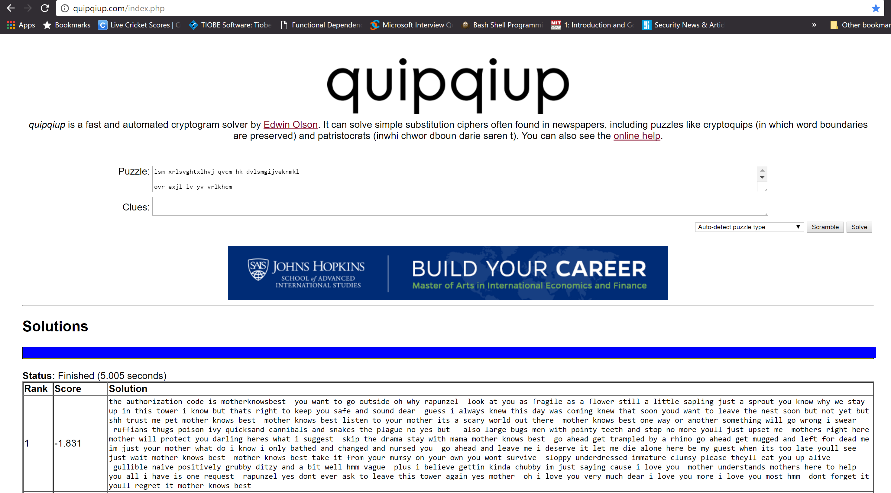

# Pico-CTF 2014: Substitution

**Category:** Cryptography
**Points:** 50
**Total Solves:** Not Available
## Problem Description:

[//]: # (> This program is vulnerable to a format string attack! See if you can modify a variable by supplying a format string! The binary can be found at /home/format/ on the shell server. The source can be found [here](format.c\).)
> There's an authorization code for some Thyrin Labs information here, along with someone's favorite song. But it's been encrypted! Find the authorization code.
[encrypted.txt](encrypted.txt)

## Write-up
[//]: # (> Your write up goes here.)
> As the name suggest this is substitution cipher. The best way to solve it is [http://quipqiup.com/index.php](http://quipqiup.com/index.php)

> Flag is : **motherknowsbest**

## Other write-ups and resources

* None
