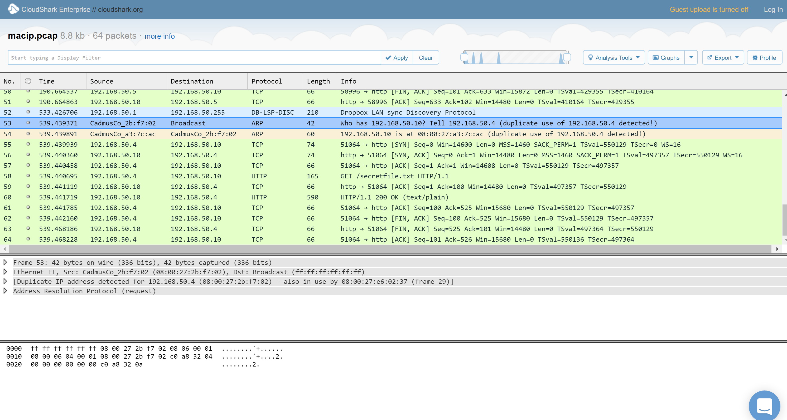

# Pico-CTF 2014: Spoof Proof

**Category:** Forensics
**Points:** 60
**Total Solves:** Not Available
## Problem Description:

[//]: # (> This program is vulnerable to a format string attack! See if you can modify a variable by supplying a format string! The binary can be found at /home/format/ on the shell server. The source can be found [here](format.c).)
>  The police have retrieved a network trace of some suspicious activity. Most of the traffic is users viewing their own profiles on a social networking website, but one of the users on the network downloaded a file from the Thyrin Labs VPN and spoofed their IP address in order to hide their identity. Can you figure out the last name of person that accessed the Thyrin files, and the two source IP addresses they used?
[Example valid flag format: "davis,192.168.50.6,192.168.50.7"]

> PCAP file available [here](https://picoctf.com/problem-static/forensics/spoof-proof/traffic.pcap). You can also view it on [CloudShark](https://www.cloudshark.org/captures/44e55fba6c1b)

## Write-up
[//]: # (> Your write up goes here.)
> Looking at the packet capture at Cloudshark there is spoofed ARP broadcast from address 192.168.50.4 for address of 192.168.50.10 looking. Looking at the source of this broadcast it turns out to be form `CadmusCo_2b:f7:02` which is actually src of 192.168.50.3 which proofs that 192.68.50.3 trie to spoof its address and then downloaded the secret file. `Profile name of 192.168.50.3 is john.johnson`. 

> Combining all the information we get flag as : **johnson,192.168.50.3,192.168.50.4**

## Other write-ups and resources

* None
