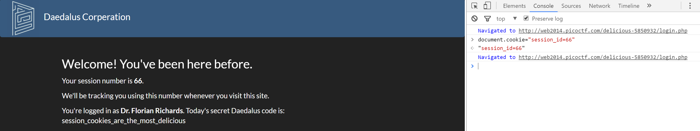

# Pico-CTF 2014: Delicious

**Category:** Web Exploitation
**Points:** 60
**Total Solves:** Not Available
## Problem Description:

[//]: # (> This program is vulnerable to a format string attack! See if you can modify a variable by supplying a format string! The binary can be found at /home/format/ on the shell server. The source can be found [here](format.c\).)
> You have found the administrative control panel for the Daedalus Coperation Website: [https://web2014.picoctf.com/delicious-5850932/login.php](http://web2014.picoctf.com/delicious-5850932/login.php). Unfortunately, it requires that you be logged in. Can you find a way to convince the web site that you are, in fact, logged in?

## Write-up
[//]: # (> Your write up goes here.)
> As on the page session id is mentioned probably cookies are used to maintain the session. 
Looking at the Cookies for this page we see there is cookie with session_id=67, if we can change the session_id to something who is logged then we might be able to view the flag. 
To modify the cookie content, opened the developer console in Chrome with Ctrl+shif+J. TO access the cooke conten we can go under console tab and access the cookie with document.cookie. 
To modify the session_id in cookie `document.cookie="session_id=66". 

> After modifying the session_id to 66 we get the flag : **session_cookies_are_the_most_delicious**

## Other write-ups and resources

* None
